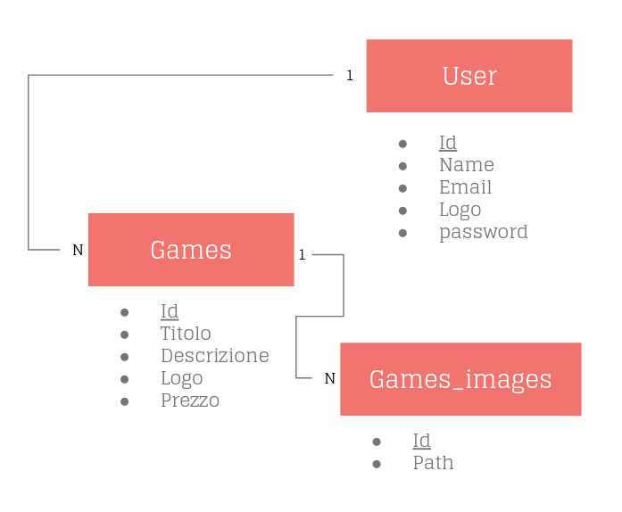

# Elaborato 

[sito](https://f37c352ae614.ngrok.io)

## 1

La tabella users conterrà i dati degli utenti registrati sul sito, che potranno avere 0 o più giochi,che a loro volta avranno 0 o più immagini.





## 2

```sql
mysql> show tables;
+---------------------+
| Tables_in_elaborato |
+---------------------+
| contacts            |
| game_images         |
| games               |
| migrations          |
| users               |
+---------------------+

mysql> describe games;
+-------------+---------------------+------+-----+---------+----------------+
| Field       | Type                | Null | Key | Default | Extra          |
+-------------+---------------------+------+-----+---------+----------------+
| id          | bigint(20) unsigned | NO   | PRI | NULL    | auto_increment |
| user_id     | int(11)             | NO   |     | NULL    |                |
| titolo      | varchar(255)        | NO   |     | NULL    |                |
| descrizione | text                | NO   |     | NULL    |                |
| logo        | text                | NO   |     | NULL    |                |
| prezzo      | double(8,2)         | NO   |     | NULL    |                |
| created_at  | timestamp           | YES  |     | NULL    |                |
| updated_at  | timestamp           | YES  |     | NULL    |                |
+-------------+---------------------+------+-----+---------+----------------+

mysql> describe game_images;
+------------+---------------------+------+-----+---------+----------------+
| Field      | Type                | Null | Key | Default | Extra          |
+------------+---------------------+------+-----+---------+----------------+
| id         | bigint(20) unsigned | NO   | PRI | NULL    | auto_increment |
| game_id    | int(11)             | NO   |     | NULL    |                |
| path       | varchar(255)        | NO   |     | NULL    |                |
| created_at | timestamp           | YES  |     | NULL    |                |
| updated_at | timestamp           | YES  |     | NULL    |                |
+------------+---------------------+------+-----+---------+----------------+

mysql> describe users;
+-------------------+---------------------+------+-----+-----------------+----------------+
| Field             | Type                | Null | Key | Default         | Extra          |
+-------------------+---------------------+------+-----+-----------------+----------------+
| id                | bigint(20) unsigned | NO   | PRI | NULL            | auto_increment |
| name              | varchar(255)        | NO   |     | NULL            |                |
| email             | varchar(255)        | NO   | UNI | NULL            |                |
| email_verified_at | timestamp           | YES  |     | NULL            |                |
| logo              | varchar(255)        | NO   |     | Placeholder.svg |                |
| password          | varchar(255)        | NO   |     | NULL            |                |
| remember_token    | varchar(100)        | YES  |     | NULL            |                |
| created_at        | timestamp           | YES  |     | NULL            |                |
| updated_at        | timestamp           | YES  |     | NULL            |                |
+-------------------+---------------------+------+-----+-----------------+----------------+

mysql> select count(games.id)as "numero giochi",name from games inner join users on users.id=games.user_id group by users.id;
+---------------+--------------------------+
| numero giochi | name                     |
+---------------+--------------------------+
|             1 | Cordelia Schumm          |
|             2 | Enola Stiedemann III     |
|             1 | Vance Leffler            |
|             2 | Tyree Zieme              |
|             1 | Mr. Emery Schulist       |
|             1 | Annamarie Grant          |
|             1 | Brown Mraz               |
|             2 | Manley Windler           |
|             2 | Roberta DuBuque Jr.      |
|             1 | Mr. Elmore Wilderman V   |
|             2 | Cyril Schmitt            |
|             1 | Maximillian Christiansen |
|             1 | Prof. Phyllis Boehm      |
+---------------+--------------------------+

mysql> update users set name="Mario Rossi" where id=1;
Rows matched: 1  Changed: 1  Warnings: 0


```


## 3

> NOTE:
> presenterò alcuni file d'esempio per fare capire anche il resto del progetto
> consiglio di aprire i file indicati per capire meglio il documento

Incominciamo dal file `routes/web.php`, che ad ogni endpoint assegna una pagina chiamata "view"(una pagina scritta in blade che estende il php con delle features)
come nei primi due casi o un metodo di una classe come nell'ultimo caso.

```php

//ritorna una view
Route::get('/', function () {
    return view('welcome');
})->name("welcome");

//ritorna una view
Route::get('/business', function () {
    return view('business');
})->name("business");

//chiama una classe
Route::post('/contacts',[ContactController::class, 'store']);
```

[più informazioni sulla documentazione sulle route](https://laravel.com/docs/8.x/routing)

Passiamo poi al file incluso in web.php `routes/auth.php` dove troveremo le routes di autenticazione, che usano dei middlewere.
I middlewere servono per reindirizzare l'utente quando si verificano determinate situazioni, per esempio il middleware guest reindirizza l'utente se è loggato (infatti è utilizzato dalla pagina login che non viene visualilzzata quando l'utente è loggato)

[più informazioni sulla documentazione di middleware](https://laravel.com/docs/8.x/middleware)
```php

//esempio
Route::get('/register', [RegisteredUserController::class, 'create'])
    ->middleware('guest')
    ->name('register');

```
Passiamo a `routes/user.php` qui sono definite le route che hanno a che fare con gli utenti,
viene usato il middleware auth che reindirizza il clinet se non è loggato,
e usa la funzione name per dare un nome alle route.

```php
//esempio
Route::get('/users/{id}',[UsersController::class, 'show'] )->middleware(['auth']);
```


[più informazioni sulla documentazione sulle named route](https://laravel.com/docs/8.x/routing#named-routes)

infine abbiamo il file `routes/games.php` qui definiamo le route che si basano sulle tabelle che contengono i dati dei giochi
```php
//esempio
Route::get('/register', [RegisteredUserController::class, 'create'])
    ->middleware('guest')
    ->name('register');
```


[più informazioni sulla documentazione di route](https://laravel.com/docs/8.x/routing)


Come esempio utilizziamo questa route che ritorna la view welcome alla richiesta dell'endpoint '/'

```php
Route::get('/', function () {
    return view('welcome');
})->name("welcome");

```
questa view è definita in `resources/views/welcome.blade.php` scritta in blade, come noteremo subito per il particolare tag.
Il primo tag che non capiremo è il x-app-layout,
questo è un tag particolare che indica  che la pagina dovrà essere inserita dentro un layout.
Questo layout include dei componenti  che sappiamo dovremo riutilizzare in più pagine; quindi li definiamo solo una volta in questo layout, che si trova su `resources/views/layout/app.blade.php`.
Nella prima riga troveremo 

```html
    <meta name="csrf-token" content="{{ csrf_token() }}">
```

le `{{}}` in mezzo al codice html indicano che manderemo in esecuzione una stringa php e inseriremo nell'html il suo  risultato; in questo caso aggiunge un token [csrf](https://en.wikipedia.org/wiki/Cross-site_request_forgery) 

Più avanti troveremo altre direttive in blade come :`@include('layouts.navigation')` che include il file con la nav bar.
Una variabile importante in blade  è `$slot` che aggiunge ciò che è contenuto nel tag `<x-app-layout>` 
(consiglio di visualizzare entro `resources/views/layout/navigation.blade.php` per vedere altri esempi di blade).

[più informazioni sulla documentazione di blade](https://laravel.com/docs/8.x/blade)

```html
<form action="/contacts" method="post" >
    @csrf
    <x-input type="text" id="name" name="name" class=""></x-input> 
    <x-input type="email" id="email" name="email" class=""></x-input> 
    <textarea id="message" name="message" class="input w-full h-32  resize-none "></textarea>
    <x-button type="subilmt" class="">Manda</x-button>
</form>
```
più avanti su welcome troveremo un form che contine dei tag  simili a quelli visti prima in welcome, che sono x-button e x-input.
Questi componenti  si trovano in `resouces/views/components/`  e sono scritti in blade, quindi utilizzano variabili come `$slot` e in più
possono unire attributi predefiniti a quelli passati in input al componente.
Questi componenti si tradurranno in semplici input e button costumizzati.
Attraverso il form una volta riempiti manderanno tutto alla pagina contacts.


Dopo aver visto una route che ritorna una view,
ne guardiamo una che chiama un metodo di una classe;
infatti questa route gestisce le richieste fatte con il metodo post nell'endpoint `/contacts`, chiamando la classe ContactControllr e in particolare il metodo store. 
```php
Route::post('/contacts',[ContactController::class, 'store']);
```
La classe si trova in `App/Http/Controllers/ContactController.php`,
nella prima riga creiamo un oggetto Contact che si trova in `App/Model/Contact.php`,
questo oggetto è collegato al database tramite una name convention, 
per cui non c'è bisogno di specificare il nome della tabella che è definita in
`database/migrations/2021_05_08_111036_create_contacts_table.php`
questo file serve per specificare i campi della tabella del database, e così facendo il framework è in grado di generare le tabelle e riconoscere i campi.
Attraverso questa classe contact possiamo interagire con il database.

[Model Eloquent](https://laravel.com/docs/8.x/eloquent)

continuando chiameremo il metodo validate sulla request (è un oggetto che contine i dati della richiesta http) attraverso la quale possiamo validare i dati,
e in caso di errore tornare indietro alla pagina precedente mostrando gli errori tramite la variabilie `error`.
Una volta validati i dati li inseriamo nell'oggetto Contact precedentemente creato,
che salviamo nel database, e restituiamo la view `resources/views/contacts.blade.php`

## 4

**PAGINA CONTATTI**


----
**PAGINE GIOCHI E UTENTI**


---
**PAGINA CREATE E MODIFY**


